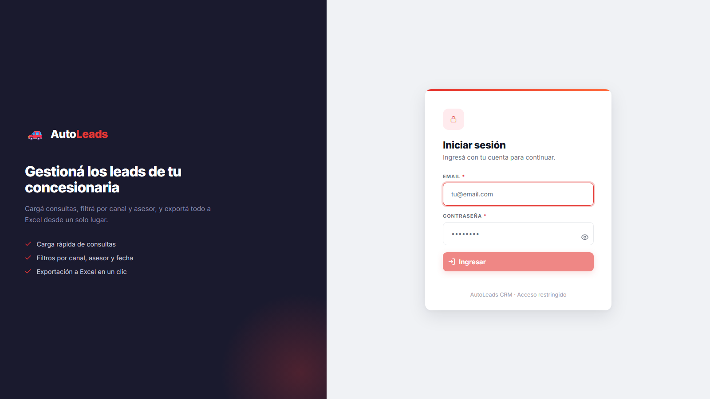
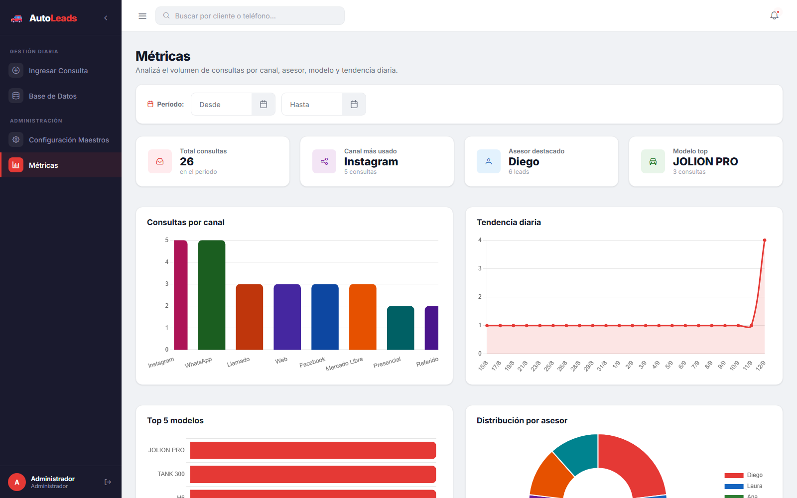

# AutoLeads CRM

Mini-CRM para gestión de consultas y leads de concesionaria de vehículos.

## Stack Tecnológico

| Capa | Tecnología |
|------|-----------|
| Frontend | React 18 + Vite + PrimeReact 10 |
| Backend | .NET 9 Minimal APIs + Dapper |
| Excel | ClosedXML |
| Base de datos | PostgreSQL 16 |
| Infraestructura | Docker Compose |
| Frontend deploy | Cloudflare Pages |
| Backend deploy | Oracle Cloud VPS (Linux) |

---

## Capturas

### Inicio de sesión (JWT + roles)


### Ingreso de consulta (carga rápida)


### Base de datos (filtros + export a Excel)


### Configuración de datos maestros (modelos, vendedores y usuarios)


### Métricas (KPIs y gráficos)


---

## Inicio rápido (desarrollo local)

### Requisitos
- **Docker Desktop** con Docker Compose
- **Node.js 20+** y npm
- **.NET 9 SDK** (solo para tests)

### 1. Iniciar Backend + Base de Datos

```bash
cd autoleads-crm
cp .env.example .env      # local usa ASPNETCORE_ENVIRONMENT=Development
docker compose up -d
```

El API queda disponible en `http://localhost:5000`.  
La BD queda disponible en `localhost:5433` (el compose mapea `5433:5432`).

> El `.env.example` trae `ASPNETCORE_ENVIRONMENT=Development`, así que en local
> usa orígenes CORS de desarrollo. Igual necesitás setear `JWT_SECRET` (sin esa
> variable la API no arranca). Para producción cambiá a `Production` y completá
> `JWT_SECRET` y `ALLOWED_ORIGINS`.

> Al primer arranque, PostgreSQL crea las tablas e inserta 10 modelos, 6 vendedores y 25 consultas de seed.
> La API también ejecuta una migración idempotente (por si el volumen ya existía)
> y crea el primer administrador si no hay ninguno activo (ver
> **Autenticación**). Si no seteaste `SEED_ADMIN_PASSWORD`, la contraseña
> temporal aparece en `docker compose logs api`.

Verificar que todo funciona:
```bash
curl http://localhost:5000/health
# Respuesta: {"status":"ok","timestamp":"..."}
```

### 2. Iniciar Frontend

```bash
cd frontend
npm install      # solo la primera vez
npm run dev
```

Abre **http://localhost:5173** en el navegador.

---

## Tests

Los tests son de integración y requieren PostgreSQL corriendo.

```bash
# Asegúrate de que la BD esté activa:
docker compose up db -d

cd backend-tests
dotnet test -v normal
# Resultado esperado: 14/14 PASS (6 repository + 2 metrics + 3 excel + 3 auth)
```

---

## Variables de entorno

| Variable | Dónde | Descripción |
|----------|-------|-------------|
| `JWT_SECRET` | Backend (`.env` del root) | Clave de firma de los JWT. Obligatoria y de al menos 32 bytes (256 bits) para HS256: la API no arranca si falta o es más corta. |
| `ALLOWED_ORIGINS` | Backend (`.env` del root) | Orígenes CORS permitidos, separados por coma. Fallback de desarrollo: `localhost:5173`, `localhost:3000`, `127.0.0.1:5173`. Si está seteada pero queda vacía tras el split, la API no arranca. |
| `SEED_ADMIN_EMAIL` | Backend (`.env` del root) | Email del admin que se crea si no hay ningún admin activo. Default: `admin@autoleads.com`. |
| `SEED_ADMIN_PASSWORD` | Backend (`.env` del root) | Contraseña del admin inicial. Si queda vacía, se genera una temporal aleatoria y se loguea una vez. |
| `VITE_API_URL` | Frontend (Cloudflare Pages) | URL pública del backend. |
| `DATABASE_URL` | Backend (docker-compose) | Connection string de PostgreSQL. |

### Autenticación (JWT + roles)

Todos los endpoints bajo `/api/*` requieren una sesión válida. El JWT se
transporta en una **cookie `HttpOnly`** que setea el backend al loguear: el
frontend nunca lo lee ni lo guarda (no hay token en `localStorage`), así que un
XSS no puede exfiltrarlo. Solo `/health`, `/api/auth/login` y
`/api/auth/logout` son públicos.

- `POST /api/auth/login` con `{ email, password }` devuelve `{ nombre, rol }` y
  setea la cookie de sesión.
- `GET /api/auth/me` devuelve `{ nombre, rol }` de la sesión actual (lo usa el
  frontend para restaurar la sesión al recargar).
- `POST /api/auth/logout` borra la cookie.
- El token expira a las **8 horas** (una jornada laboral). No hay refresh token.
- En cada request autenticado se valida contra la BD que la cuenta siga
  **activa** y con el **mismo rol**: desactivar o degradar a un usuario invalida
  sus tokens vigentes.

> Nota de deploy: con frontend y API en sitios distintos (ej. `pages.dev` vs
> `api.tu-dominio.com`) la cookie es cross-site y depende de `SameSite=None`;
> algunos navegadores bloquean cookies de terceros. Lo recomendado es servir
> ambos bajo el mismo sitio (ej. `app.tu-dominio.com` + `api.tu-dominio.com`).
- Roles: `admin` (acceso total) y `asesor` (solo Ingresar Consulta y Base de Datos).
- Escrituras de datos maestros (POST/PUT/DELETE de `modelos` y `vendedores`) y
  `GET /api/consultas/metricas` exigen rol `admin`; un asesor recibe `403`.
- Contraseñas hasheadas con **BCrypt** (BCrypt.Net-Next).

El primer administrador **no** viene con una contraseña publicada en el repo. Al
arrancar, si no hay ningún admin activo, la API crea uno:

- Usa `SEED_ADMIN_EMAIL` (default `admin@autoleads.com`).
- Usa `SEED_ADMIN_PASSWORD` si la seteaste. Si no, genera una contraseña temporal
  aleatoria y la escribe en el log del contenedor una única vez:
  ```bash
  docker compose logs api | grep "contraseña temporal"
  ```
  Cambiala después de ingresar. Este bootstrap también cubre un volumen de
  PostgreSQL ya inicializado (donde `init.sql` no vuelve a correr).

- Si `JWT_SECRET` **no** está seteada o es menor a 32 bytes: la API **no arranca**.
- Si `ALLOWED_ORIGINS` **no** está seteada: en `Development` usa el fallback
  local; en `Production` la API **no arranca** (evita quedar "sana" pero
  bloqueando el frontend por CORS).

---

## Endpoints de la API

| Método | Ruta | Auth | Descripción |
|--------|------|------|-------------|
| `GET`  | `/health` | No | Health check |
| `POST` | `/api/auth/login` | No | Login (`email`, `password`) → `{ nombre, rol }` + cookie de sesión |
| `POST` | `/api/auth/logout` | No | Borra la cookie de sesión |
| `GET`  | `/api/auth/me` | JWT | Identidad actual (`{ nombre, rol }`) |
| `GET`  | `/api/catalogos` | JWT | Opciones de dropdowns (canales, modelos, asesores, ciudades) |
| `GET`  | `/api/consultas` | JWT | Listar consultas con filtros opcionales |
| `POST` | `/api/consultas` | JWT | Crear nuevo lead |
| `GET`  | `/api/consultas/export` | JWT | Descargar Excel filtrado |
| `GET`  | `/api/modelos` | JWT | Listar modelos |
| `POST`/`PUT`/`DELETE` | `/api/modelos` | admin | CRUD de modelos |
| `GET`  | `/api/vendedores` | JWT | Listar vendedores |
| `POST`/`PUT`/`DELETE` | `/api/vendedores` | admin | CRUD de vendedores |
| `GET`  | `/api/consultas/metricas` | admin | Agregados para dashboard (total, por canal/asesor/modelo/día) |
| `GET`  | `/api/usuarios` | admin | Listar usuarios |
| `POST` | `/api/usuarios` | admin | Crear usuario |
| `PUT`  | `/api/usuarios/{id}` | admin | Editar usuario (nombre, email, rol, activo) |
| `PUT`  | `/api/usuarios/{id}/password` | admin | Cambiar contraseña |
| `DELETE` | `/api/usuarios/{id}` | admin | Desactivar usuario (borrado lógico) |

### Filtros disponibles (query params para GET /api/consultas y export)

| Parámetro | Tipo | Ejemplo |
|-----------|------|---------|
| `canal` | string | `WhatsApp` |
| `asesorAsignado` | string | `Diego` |
| `fechaDesde` | YYYY-MM-DD | `2026-01-01` |
| `fechaHasta` | YYYY-MM-DD | `2026-12-31` |

### Body de POST /api/consultas

```json
{
  "canal": "WhatsApp",
  "modelo": "H6 Pro Hev",
  "nombreCliente": "Juan Pérez",
  "telefono": "341-5061333",
  "ciudad": "Rosario",
  "asesorAsignado": "Diego",
  "observaciones": "Interesado en financiación"
}
```

---

## Esquema de Base de Datos

```sql
CREATE TABLE consultas (
    id               SERIAL PRIMARY KEY,
    fecha            TIMESTAMPTZ NOT NULL DEFAULT NOW(),
    canal            VARCHAR(50)  NOT NULL,
    modelo           VARCHAR(100) NOT NULL,
    nombre_cliente   VARCHAR(200) NOT NULL,
    telefono         VARCHAR(30)  NOT NULL,
    ciudad           VARCHAR(100),
    asesor_asignado  VARCHAR(100) NOT NULL,
    observaciones    TEXT
);

CREATE TABLE usuarios (
    id            SERIAL PRIMARY KEY,
    nombre        VARCHAR(200) NOT NULL,
    email         VARCHAR(200) NOT NULL,
    password_hash VARCHAR(255) NOT NULL,
    rol           VARCHAR(20)  NOT NULL CHECK (rol IN ('admin','asesor')),
    activo        BOOLEAN NOT NULL DEFAULT TRUE
);

-- Unicidad case-insensitive del email (el login matchea lower(email)).
CREATE UNIQUE INDEX ux_usuarios_email_lower ON usuarios (lower(email));
```

---

## Antes de deployar

Checklist obligatorio antes de exponer la API:

1. **Setear `ASPNETCORE_ENVIRONMENT=Production`** en el `.env` del root del VPS
   (el `.env.example` viene con `Development` para local). Con `Production` la
   API es fail-fast si falta `ALLOWED_ORIGINS`.
2. **Generar un `JWT_SECRET` real** y guardarlo en ese `.env`:
   ```bash
   openssl rand -hex 32
   ```
   Copiá el valor a `JWT_SECRET=`. No lo commitees. Sin esta variable la API no arranca.
3. **Setear `ALLOWED_ORIGINS`** con el dominio real de Cloudflare Pages, ej:
   ```bash
   ALLOWED_ORIGINS=https://autoleads-crm.pages.dev
   ```
   Para varios orígenes, separalos con coma (sin espacios): `https://a.com,https://b.com`.
   Si falta en `Production`, la API **no arranca** (a propósito).
4. **Definir el admin inicial** con `SEED_ADMIN_EMAIL` y `SEED_ADMIN_PASSWORD`
   en el `.env` (si no seteás password, la API genera una temporal y la escribe
   en el log). No hay contraseñas seed publicadas en el repo. Cambiá la
   contraseña del admin después del primer ingreso.
5. Al arrancar, revisar el log del contenedor: debe decir
   `JWT_SECRET: configurada` y la lista de `ALLOWED_ORIGINS` correcta:
   ```bash
   docker compose logs api | grep "Configuración de arranque"
   ```
6. Verificar el healthcheck (no requiere auth):
   ```bash
   curl https://api.tu-dominio.com/health
   ```
7. Verificar que sin token la API rechaza:
   ```bash
   curl -i https://api.tu-dominio.com/api/consultas
   # Esperado: HTTP/1.1 401 Unauthorized
   ```

---

## Deploy en Producción

### Backend — Oracle Cloud VPS (Linux)

1. Clonar el repo en el VPS
2. Crear `.env` desde `.env.example` y completar `ASPNETCORE_ENVIRONMENT=Production`,
   `JWT_SECRET` y `ALLOWED_ORIGINS` (ver sección **Antes de deployar**)
3. Iniciar servicios:
   ```bash
   docker compose up -d
   ```
4. Configurar **nginx** como reverse proxy:
   ```nginx
   server {
       listen 80;
       server_name api.tu-dominio.com;

       location / {
           proxy_pass http://localhost:5000;
           proxy_set_header Host $host;
           proxy_set_header X-Real-IP $remote_addr;
       }
   }
   ```
5. Agregar SSL con Certbot:
   ```bash
   sudo certbot --nginx -d api.tu-dominio.com
   ```

### Frontend — Cloudflare Pages

1. Conectar el repositorio en [Cloudflare Pages](https://pages.cloudflare.com/)
2. Configurar el proyecto:
   - **Framework preset**: Vite
   - **Build command**: `npm run build`
   - **Build output directory**: `dist`
   - **Root directory**: `frontend`
3. Agregar variable de entorno en Cloudflare Pages:
   - `VITE_API_URL` = `https://api.tu-dominio.com`
4. Setear `ALLOWED_ORIGINS` en el `.env` del backend con el dominio de
   Cloudflare Pages (ya no se edita `Program.cs`).

---

## Estructura del Proyecto

```
autoleads-crm/
├── docker-compose.yml          # Orquesta API + PostgreSQL
├── .env.example                # Template de variables de entorno
├── README.md
│
├── docs/
│   └── screenshots/            # Capturas usadas en el README
│
├── backend/                    # .NET 9 Minimal API
│   ├── AutoLeads.Api.csproj
│   ├── Program.cs              # Entry point, DI, auth JWT, rutas
│   ├── Dockerfile              # Multi-stage build
│   ├── sql/
│   │   └── init.sql            # Schema + seed data
│   ├── Models/
│   │   ├── Consulta.cs         # Entidad + DTOs
│   │   ├── Usuario.cs          # Entidad usuario + LoginRequest
│   │   └── Metricas.cs         # DTOs de agregación del dashboard
│   ├── Data/
│   │   ├── ConsultaRepository.cs   # Dapper queries con filtros dinámicos
│   │   ├── UsuarioRepository.cs    # Dapper, login/CRUD de usuarios
│   │   ├── MetricasRepository.cs   # Dapper, agregaciones GROUP BY
│   │   └── DatabaseInitializer.cs  # Migración idempotente al arrancar
│   └── Services/
│       ├── ExcelService.cs     # Generación Excel con ClosedXML
│       ├── JwtService.cs       # Firma de JWT (HS256, 8h)
│       └── AdminBootstrapper.cs # Crea el primer admin (sin seed público)
│
├── backend-tests/              # xUnit tests
│   ├── AutoLeads.Tests.csproj
│   ├── ConsultaRepositoryTests.cs
│   ├── ExcelServiceTests.cs
│   └── AuthTests.cs            # JWT + BCrypt
│
└── frontend/                   # Vite React SPA
    ├── package.json
    ├── vite.config.js          # Proxy /api → localhost:5000
    ├── index.html              # Inter font, SEO meta tags
    ├── .env.example
    └── src/
        ├── main.jsx            # React + PrimeReact + AuthProvider
        ├── App.jsx             # Router + rutas protegidas (auth/admin)
        ├── index.css           # Design system completo
        ├── api/
        │   └── client.js       # Axios instance + interceptor JWT/401
        ├── context/
        │   └── AuthContext.jsx # Sesión: user, token, login, logout
        ├── components/
        │   ├── Sidebar.jsx     # Navegación lateral + usuario/logout
        │   └── TopBar.jsx      # Barra de búsqueda + notificaciones
        ├── hooks/
        │   ├── useConsultas.js # useCatalogos + useConsultas hooks
        │   ├── useUsuarios.js  # CRUD de usuarios (admin)
        │   └── useMetricas.js  # Dashboard de métricas (admin)
        └── pages/
            ├── Login.jsx          # Login (email + contraseña)
            ├── NuevaConsulta.jsx  # Formulario de carga rápida
            ├── BaseDeDatos.jsx    # DataTable + filtros + export Excel
            └── Metricas.jsx       # KPIs + gráficos (Chart.js)
```
