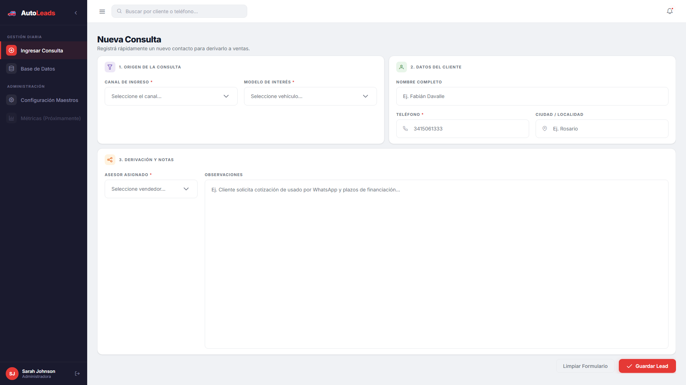
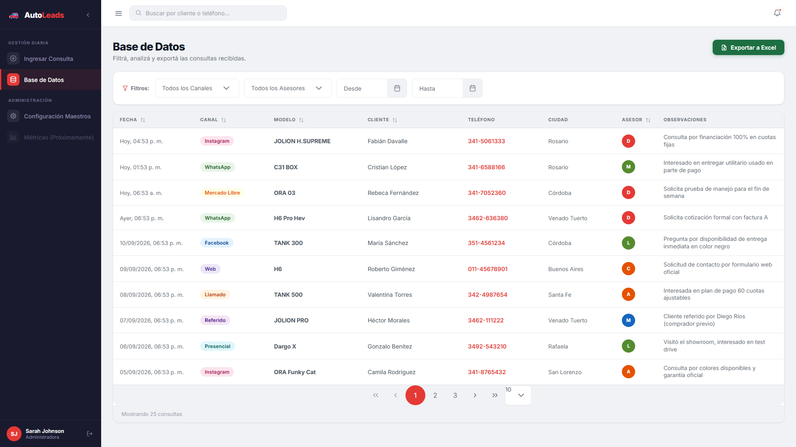
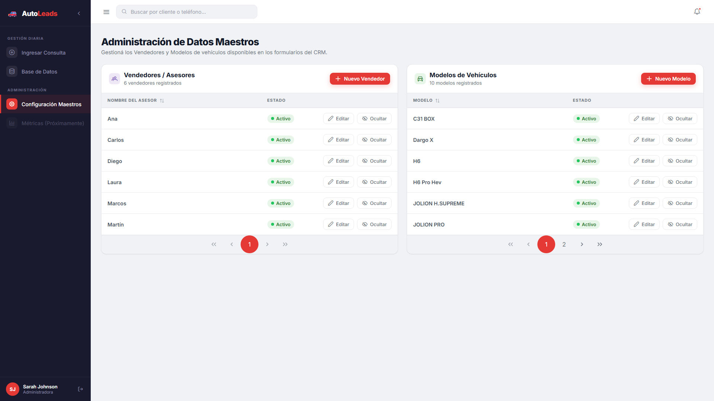

# AutoLeads CRM

Mini-CRM para gestión de consultas y leads de concesionaria de vehículos.

## Stack Tecnológico

| Capa | Tecnología |
|------|-----------|
| Frontend | React 18 + Vite + PrimeReact 10 |
| Backend | .NET 9 Minimal APIs + Dapper |
| Excel | ClosedXML |
| Base de datos | PostgreSQL 16 |
| Infraestructura | Docker Compose |
| Frontend deploy | Cloudflare Pages |
| Backend deploy | Oracle Cloud VPS (Linux) |

---

## Capturas

### Ingreso de consulta (carga rápida)


### Base de datos (filtros + export a Excel)


### Configuración de datos maestros (modelos y vendedores)


---

## Inicio rápido (desarrollo local)

### Requisitos
- **Docker Desktop** con Docker Compose
- **Node.js 20+** y npm
- **.NET 9 SDK** (solo para tests)

### 1. Iniciar Backend + Base de Datos

```bash
cd autoleads-crm
docker compose up -d
```

El API queda disponible en `http://localhost:5000`.  
La BD queda disponible en `localhost:5433` (el compose mapea `5433:5432`).

> Al primer arranque, PostgreSQL crea las tablas e inserta 10 modelos, 6 vendedores y 25 consultas de seed.

Verificar que todo funciona:
```bash
curl http://localhost:5000/health
# Respuesta: {"status":"ok","timestamp":"..."}
```

### 2. Iniciar Frontend

```bash
cd frontend
npm install      # solo la primera vez
npm run dev
```

Abre **http://localhost:5173** en el navegador.

---

## Tests

Los tests son de integración y requieren PostgreSQL corriendo.

```bash
# Asegúrate de que la BD esté activa:
docker compose up db -d

cd backend-tests
dotnet test -v normal
# Resultado esperado: 9/9 PASS (6 repository + 3 excel)
```

---

## Variables de entorno

| Variable | Dónde | Descripción |
|----------|-------|-------------|
| `API_KEY` | Backend (`.env` del root) | Clave server-to-server. Requerida en todo `/api/*` (header `X-Api-Key`). `/health` queda público. |
| `ALLOWED_ORIGINS` | Backend (`.env` del root) | Orígenes CORS permitidos, separados por coma. Fallback de desarrollo: `localhost:5173`, `localhost:3000`, `127.0.0.1:5173`. |
| `VITE_API_URL` | Frontend (Cloudflare Pages) | URL pública del backend. |
| `VITE_API_KEY` | Frontend (Cloudflare Pages) | Debe coincidir con `API_KEY` del backend. |
| `DATABASE_URL` | Backend (docker-compose) | Connection string de PostgreSQL. |

### Autenticación

Todos los endpoints bajo `/api/*` requieren el header `X-Api-Key`. Sin la key
correcta responden `401`. `/health` no requiere auth (lo usa el healthcheck).

- Si `API_KEY` **no** está seteada: en `Development` la API no valida; en
  `Production` responde `503` (fail-closed).
- El frontend manda el header automáticamente desde `VITE_API_KEY`.

> Nota: al ser una SPA, `VITE_API_KEY` queda embebida en el bundle del
> navegador y es visible en las DevTools. Sube la barrera contra acceso casual,
> pero no es un secreto criptográfico.

---

## Endpoints de la API

| Método | Ruta | Auth | Descripción |
|--------|------|------|-------------|
| `GET`  | `/health` | No | Health check |
| `GET`  | `/api/catalogos` | `X-Api-Key` | Opciones de dropdowns (canales, modelos, asesores, ciudades) |
| `GET`  | `/api/consultas` | `X-Api-Key` | Listar consultas con filtros opcionales |
| `POST` | `/api/consultas` | `X-Api-Key` | Crear nuevo lead |
| `GET`  | `/api/consultas/export` | `X-Api-Key` | Descargar Excel filtrado |

### Filtros disponibles (query params para GET /api/consultas y export)

| Parámetro | Tipo | Ejemplo |
|-----------|------|---------|
| `canal` | string | `WhatsApp` |
| `asesorAsignado` | string | `Diego` |
| `fechaDesde` | YYYY-MM-DD | `2026-01-01` |
| `fechaHasta` | YYYY-MM-DD | `2026-12-31` |

### Body de POST /api/consultas

```json
{
  "canal": "WhatsApp",
  "modelo": "H6 Pro Hev",
  "nombreCliente": "Juan Pérez",
  "telefono": "341-5061333",
  "ciudad": "Rosario",
  "asesorAsignado": "Diego",
  "observaciones": "Interesado en financiación"
}
```

---

## Esquema de Base de Datos

```sql
CREATE TABLE consultas (
    id               SERIAL PRIMARY KEY,
    fecha            TIMESTAMPTZ NOT NULL DEFAULT NOW(),
    canal            VARCHAR(50)  NOT NULL,
    modelo           VARCHAR(100) NOT NULL,
    nombre_cliente   VARCHAR(200) NOT NULL,
    telefono         VARCHAR(30)  NOT NULL,
    ciudad           VARCHAR(100),
    asesor_asignado  VARCHAR(100) NOT NULL,
    observaciones    TEXT
);
```

---

## Antes de deployar

Checklist obligatorio antes de exponer la API:

1. **Generar un `API_KEY` real** y guardarlo en el `.env` del root del VPS:
   ```bash
   openssl rand -hex 32
   ```
   Copiá el valor a `API_KEY=` en `.env`. No lo commitees.
2. **Setear `ALLOWED_ORIGINS`** con el dominio real de Cloudflare Pages, ej:
   ```bash
   ALLOWED_ORIGINS=https://autoleads-crm.pages.dev
   ```
   Para varios orígenes, separalos con coma (sin espacios): `https://a.com,https://b.com`.
3. **Confirmar que `VITE_API_KEY` del frontend coincide** con el `API_KEY` del
   backend. Se configura en Cloudflare Pages → Settings → Environment variables.
4. **Confirmar que `ASPNETCORE_ENVIRONMENT=Production`**, así la API es
   fail-closed si falta `API_KEY`.
5. Al arrancar, revisar el log del contenedor: debe decir
   `API_KEY: configurada` y la lista de `ALLOWED_ORIGINS` correcta:
   ```bash
   docker compose logs api | grep "Configuración de arranque"
   ```
6. Verificar el healthcheck (no requiere auth):
   ```bash
   curl https://api.tu-dominio.com/health
   ```
7. Verificar que sin key la API rechaza:
   ```bash
   curl -i https://api.tu-dominio.com/api/consultas
   # Esperado: HTTP/1.1 401 Unauthorized
   ```

---

## Deploy en Producción

### Backend — Oracle Cloud VPS (Linux)

1. Clonar el repo en el VPS
2. Crear `.env` desde `.env.example` y completar `API_KEY` y `ALLOWED_ORIGINS`
   (ver sección **Antes de deployar**)
3. Iniciar servicios:
   ```bash
   docker compose up -d
   ```
4. Configurar **nginx** como reverse proxy:
   ```nginx
   server {
       listen 80;
       server_name api.tu-dominio.com;

       location / {
           proxy_pass http://localhost:5000;
           proxy_set_header Host $host;
           proxy_set_header X-Real-IP $remote_addr;
       }
   }
   ```
5. Agregar SSL con Certbot:
   ```bash
   sudo certbot --nginx -d api.tu-dominio.com
   ```

### Frontend — Cloudflare Pages

1. Conectar el repositorio en [Cloudflare Pages](https://pages.cloudflare.com/)
2. Configurar el proyecto:
   - **Framework preset**: Vite
   - **Build command**: `npm run build`
   - **Build output directory**: `dist`
   - **Root directory**: `frontend`
3. Agregar variables de entorno en Cloudflare Pages:
   - `VITE_API_URL` = `https://api.tu-dominio.com`
   - `VITE_API_KEY` = el mismo valor que `API_KEY` del backend
4. Setear `ALLOWED_ORIGINS` en el `.env` del backend con el dominio de
   Cloudflare Pages (ya no se edita `Program.cs`).

---

## Estructura del Proyecto

```
autoleads-crm/
├── docker-compose.yml          # Orquesta API + PostgreSQL
├── .env.example                # Template de variables de entorno
├── README.md
│
├── docs/
│   └── screenshots/            # Capturas usadas en el README
│
├── backend/                    # .NET 9 Minimal API
│   ├── AutoLeads.Api.csproj
│   ├── Program.cs              # Entry point, DI, middleware, rutas
│   ├── Dockerfile              # Multi-stage build
│   ├── sql/
│   │   └── init.sql            # Schema + seed data
│   ├── Models/
│   │   └── Consulta.cs         # Entidad + DTOs
│   ├── Data/
│   │   └── ConsultaRepository.cs  # Dapper queries con filtros dinámicos
│   └── Services/
│       └── ExcelService.cs     # Generación Excel con ClosedXML
│
├── backend-tests/              # xUnit integration tests
│   ├── AutoLeads.Tests.csproj
│   ├── ConsultaRepositoryTests.cs
│   └── ExcelServiceTests.cs
│
└── frontend/                   # Vite React SPA
    ├── package.json
    ├── vite.config.js          # Proxy /api → localhost:5000
    ├── index.html              # Inter font, SEO meta tags
    ├── .env.example
    └── src/
        ├── main.jsx            # React + PrimeReact bootstrap
        ├── App.jsx             # Router + Layout shell
        ├── index.css           # Design system completo
        ├── api/
        │   └── client.js       # Axios instance
        ├── components/
        │   ├── Sidebar.jsx     # Navegación lateral oscura
        │   └── TopBar.jsx      # Barra de búsqueda + notificaciones
        ├── hooks/
        │   └── useConsultas.js # useCatalogos + useConsultas hooks
        └── pages/
            ├── NuevaConsulta.jsx  # Formulario de carga rápida
            └── BaseDeDatos.jsx    # DataTable + filtros + export Excel
```
